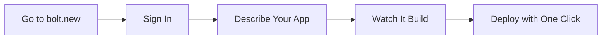

# Vibe Coding Lab

---

Welcome to the Vibe Coding Lab! In this lab, you'll explore three powerful AI-driven development tools and experience the "vibe coding" philosophy first-hand. You'll build the same application using each tool, allowing you to compare their approaches and discover which style suits you best.

---

## 🗂️ Agenda
1. [🚀 Quick Start](#1--quick-start)  
2. [🛠️ Tool 1: Google Antigravity](#2-️-tool-1-google-antigravity)  
3. [⚡ Tool 2: Bolt.new](#3--tool-2-boltnew)  
4. [🔥 Tool 3: Firebase Studio](#4--tool-3-firebase-studio)  
5. [🎯 The Challenge: Build a To-Do App](#5--the-challenge-build-a-to-do-app)  
6. [📝 Completion Checklist](#6--completion-checklist)  
7. [🔧 Troubleshooting & Help](#7--troubleshooting--help)  
8. [🤖 Vibe Coding Best Practices](#8--vibe-coding-best-practices)  
9. [🎓 Academic Integrity](#9--academic-integrity)  
10. [🔄 Alternative Tool: Cursor](#-alternative-tool-cursor)  

---

## 1. 🚀 Quick Start

In this lab, you will:

1. **Sign up** for three vibe coding platforms.
2. **Build the same application** (a To-Do list app) using each tool.
3. **Compare** the experiences and document your observations.
4. **Reflect** on the strengths and limitations of each approach.

### What is Vibe Coding?

> "There's a new kind of coding I call 'vibe coding', where you fully give in to the vibes, embrace exponentials, and forget that the code even exists."  
> — **Andrej Karpathy**, February 2025

Vibe coding is the practice of instructing AI to write code via natural language, accepting the output without deep review, and iterating rapidly based on the "vibe" or high-level intent.

---

## 2. 🛠️ Tool 1: Google Antigravity

Google Antigravity is an **Agentic IDE** — you don't just write code; you manage "Agents" that plan, code, and test autonomously.

### Setup Steps

1. **Navigate to**: [https://antigravity.google](https://antigravity.google)
2. **Sign in** with your Google account.
3. **Accept** the terms and conditions for the Public Preview.
4. **Explore** the interface — note the key features:
   - Agent Manager panel (for delegating tasks)
   - Artifacts view (where AI presents plans and test results)
   - Mission Control interface

### Key Features to Note

| Feature | Description |
|---------|-------------|
| Agent Manager | Delegate coding tasks to AI agents |
| Mission Control | Oversee multi-agent workflows |
| Artifacts View | Review AI-generated plans and code |
| Gemini 3 Pro | Powered by Google's latest model |

### ✅ Setup Verification

- [ ] Successfully logged in
- [ ] Can see the Agent Manager panel
- [ ] Can create a new project

---

## 3. ⚡ Tool 2: Bolt.new

Bolt.new is a browser-based AI development environment that lets you build and deploy web apps using natural language — no installation required.

### Setup Steps

1. **Navigate to**: [https://bolt.new](https://bolt.new)
2. **Sign in** with your GitHub or Google account.
3. **Start building** — describe what you want to create.
4. **Explore** the interface:
   - Prompt editor with live preview
   - Auto-generated code you can inspect
   - One-click deploy options

### Key Features to Note

| Feature | Description |
|---------|-------------|
| Natural Language Editor | Describe app behavior in plain English |
| Live Preview | Instant visual updates as you type |
| Managed Runtime | No hosting or deployment worries |
| Built-in Deploy | Ship to Netlify with minimal setup |

### ✅ Setup Verification

- [ ] Successfully signed in
- [ ] Can see the live preview
- [ ] Can deploy a generated app

---

## 4. 🔥 Tool 3: Firebase Studio

Firebase Studio is a **No-Code/Low-Code** powerhouse that translates prompts directly into full-stack web applications.

### Setup Steps

1. **Navigate to**: [https://firebase.google.com](https://firebase.google.com)
2. **Sign in** with your Google account.
3. **Go to the Firebase Console**: [https://console.firebase.google.com](https://console.firebase.google.com)
4. **Explore Firebase Studio** (look for AI/Studio features):
   - Prompt-based UI generation
   - Data Connect with AI
   - React/HTML code export

### Key Features to Note

| Feature | Description |
|---------|-------------|
| Data Connect with AI | AI understands your data schema |
| Prompt-based UI | Generate UI from natural language |
| Full-Stack Generation | Database, backend, and frontend in one go |
| Exportable Code | Low-code outputs (React/HTML) |

### ✅ Setup Verification

- [ ] Successfully logged in
- [ ] Created a new Firebase project
- [ ] Can access AI/Studio features

---

## 5. 🎯 The Challenge: Build a To-Do App

Now that you've set up all three tools, it's time to build the **same application** using each one. This will allow you to compare the vibe coding experience across platforms.

### The Application Requirements

Build a simple **To-Do List Application** with the following features:

1. **Add a task** with a title
2. **Mark a task as complete**
3. **Delete a task**
4. **Display all tasks** in a list

### Your Prompts

Use the following prompts (or similar) with each tool:

**Initial Prompt:**
> "Create a simple to-do list application. Users should be able to add tasks, mark them as complete, and delete them. Display all tasks in a clean list format."

**Refinement Prompts** (use as needed):
> "Add a checkbox next to each task to mark it complete"

> "Add a delete button for each task"

> "Make completed tasks appear with a strikethrough"

> "Add a count of remaining tasks at the bottom"

---

### Task 5.1: Build with Google Antigravity

1. Create a new project in Antigravity.
2. Use the Agent Manager to describe your to-do app.
3. Let the AI generate the code.
4. Review the Artifacts and approve/refine.
5. Test the application.
6. **Experiment!** Try adding extra features like due dates or priority levels.

---

### Task 5.2: Build with Bolt.new

1. Open Bolt.new in your browser and start a new app.
2. Describe your to-do app in natural language.
3. Watch the live preview update and review the generated code.
4. Refine with additional prompts.
5. Test the functionality.
6. **Experiment!** Try enabling the built-in deploy and sharing the link.

---

### Task 5.3: Build with Firebase Studio

1. Create a new project in Firebase Studio.
2. Use the prompt interface to describe your to-do app.
3. Let the AI generate the UI and data structure.
4. Refine and connect data.
5. Test the application.
6. **Experiment!** Try asking it to add user authentication or cloud sync.

---

## 6. 📝 Completion Checklist

- [ ] Signed up for all three tools
- [ ] Built a To-Do app with Google Antigravity
- [ ] Built a To-Do app with Bolt.new
- [ ] Built a To-Do app with Firebase Studio
- [ ] Experimented with refining and iterating on each app

---

## 7. 🔧 Troubleshooting & Help

### Common Issues

| Problem | Solution |
|---------|----------|
| Can't access Antigravity | May be region-restricted — try VPN or check availability |
| Bolt.new sign-in issues | Try an incognito window or switch between GitHub/Google login |
| Firebase console errors | Ensure you've enabled the correct APIs |
| AI not understanding prompts | Be more specific; break down into smaller requests |
| Generated code has bugs | Describe the bug to the AI and ask for a fix |

### Getting Help

- **Office Hours**: Ask questions during scheduled office hours
- **Moodle Forum**: Post questions for peer and instructor help
- **Documentation**: Each tool has official docs — read them!
- **Iterate**: If something doesn't work, try rephrasing your prompt

---

## 8. 🤖 Vibe Coding Best Practices

### The Vibe Coding Workflow

### Do's and Don'ts

**DO:**
- Start with clear, high-level descriptions
- Iterate in small steps
- Test frequently
- Document what works and what doesn't
- Be specific when refining

**DON'T:**
- Accept code blindly for production use
- Ignore security considerations
- Skip testing because "it looks right"
- Forget to understand what the code does
- Use vibe coding for safety-critical applications

### Effective Prompting Tips

1. **Be Specific**: "Add a red delete button on the right side of each task" is better than "add delete"
2. **Provide Context**: "This is for a mobile-first web app" helps the AI make appropriate choices
3. **Describe Behaviour**: Focus on what the app should DO, not how to code it
4. **Iterate Incrementally**: Add features one at a time rather than all at once

---

## 9. 🎓 Academic Integrity

### Remember

- **Vibe coding is about learning**, not just getting output
- **Understand what you submit** — you may be asked to explain your application
- **Document your process** — the journey is as important as the destination
- AI tools are **learning aids**, not replacements for understanding
- **Follow ATU's academic integrity policies** at all times

### What You're Learning

This lab teaches you to:
- Evaluate and compare AI development tools
- Think critically about AI-generated code
- Understand the trade-offs of different development approaches
- Develop skills in prompt engineering
- Reflect on the future of software development

---

## 🔄 Alternative Tool: Cursor

If you run into access issues with any of the tools above, Cursor is an excellent alternative that's widely used in industry.

### Cursor

Cursor is an AI-powered code editor built on VS Code. It's used by professional developers and offers a more hands-on coding experience with AI assistance built in.

**What makes it great:**
- Full IDE experience with AI that understands your entire codebase
- Access to GPT-4, Claude, and Gemini models
- Multi-file editing and intelligent debugging
- Industry-standard tool used by professional developers

#### 🎓 FREE FOR STUDENTS: One Year of Cursor Pro!

> **Eligible university students get one full year of Cursor Pro completely free** — that's a $240 value! This includes 500 fast premium requests per month and access to all premium AI models.

**Setup Steps:**

1. **Go to**: [https://cursor.com](https://cursor.com)
2. **Click "Download"** and install Cursor for your operating system (Windows, Mac, or Linux).
3. **Create an account** using your **university email address** (e.g., your @atu.ie email).
4. **Verify your student status**:
   - Go to: [https://cursor.com/students](https://cursor.com/students)
   - Click **"Verify"** and enter your academic email
   - Follow the verification steps (uses SheerID)
5. **Once verified**, your free year of Pro access will be activated automatically.

**Try the To-Do App Challenge:**
- Create a new folder for your project
- Open Cursor and press `Cmd+K` (Mac) or `Ctrl+K` (Windows) to open the AI prompt
- Type: *"Create a simple to-do list web app with HTML, CSS, and JavaScript"*
- Use `Cmd+L` / `Ctrl+L` to chat with the AI about your code
- Ask it to add features: *"Add local storage so tasks persist after refresh"*

---

### Comparison: Bolt.new vs Cursor

| Feature | Bolt.new | Cursor |
|---------|----------|--------|
| **Type** | Browser-based | Desktop IDE |
| **Best For** | Quick prototypes, beginners | Serious development, learning |
| **Setup Time** | Instant (just visit website) | 5-10 mins (download + verify) |
| **Code Access** | View only (AI writes it) | Full control (you + AI together) |
| **Cost** | Free tier available | **Free for 1 year (students)** |
| **Deployment** | One-click Netlify | Manual (Vercel, Netlify, etc.) |

**Recommendation:** Try both! Use Bolt.new for rapid prototyping, and Cursor when you want more control and a deeper understanding of the code.

---

**Happy Vibe Coding! 🎵✨**

> Remember: The goal isn't just to build apps — it's to understand how AI is changing the way we develop software.